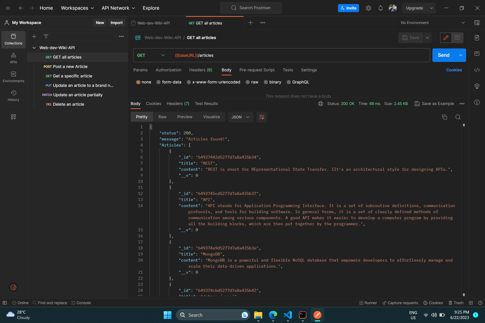

# 🧑‍💻 Web-Dev-Wiki-RESTful API
The Web-Dev-Wiki-RESTful API is a comprehensive and user-friendly API that allows you to create, retrieve, update, and delete wiki articles specifically related to web development. It provides an intuitive interface for managing web development resources, making it easy for users to access and manipulate article data through simple HTTP requests.

## Features
🔹Create new wiki articles with specified titles and content. </br>
🔹Retrieve existing articles by their titles. </br>
🔹Update article content by providing the article title along with new data. </br>
🔹Delete articles based on their title. </br>

## Technologies Used
🔸*Node.js*: A server-side JavaScript runtime environment. </br>
🔸*Express.js*: A fast and minimalist web application framework for Node.js. </br>
🔸*MongoDB*: A document-oriented NoSQL database for storing article data. </br>
🔸*Mongoose*: An Object-Data Modeling (ODM) library for MongoDB and Node.js. </br>
🔸*Postman*: A powerful tool for testing and documenting APIs. </br>

## Live Application URL

Go to Deployed Application link 👇 <br />
<a href="https://wiki-for-webdev-api.onrender.com" alt="Wiki-API-App-link">Web-Dev-Wiki-RESTful API</a> </br>


## Getting Started
To get started with the Web-Dev-Wiki-RESTful API, follow these steps:

1. Clone the repository:

```
  git clone https://github.com/Kakuli-coder/WIki-for-WebDev-API.git
```

2. Install the dependencies:

```
  npm install
```
  
3. Set up your MongoDB connection and port in the `.env` file.

4. Start the server:

```
  npm start
```

5. Use Postman or any API testing tool to interact with the API endpoints.


## Preview of API in Postman

 <br />


## API Endpoints

### Articles
▫️ `GET /articles` - Retrieve a list of all web development articles. <br/>
▫️ `POST /articles` - Create a new web development article. <br/>
▫️ `DELETE /articles` - Delete all articles. <br/>
▫️ `GET /articles/:articleTitle` - Retrieve an article by title. <br/>
▫️ `PUT /articles/:articleTitle` - Update an article by title (replace the entire resource if it exists or create new if it does not exist). <br/>
▫️ `PATCH /articles/:articleTitle` - Partially update an article by title (Fields that need to be updated by the client, Only that fields that need to be updated is updated without modifying the other field). <br/>
▫️ `DELETE /articles/:articleTitle` - Delete an article by title. <br/>


## Documentation and Testing
For detailed documentation and examples of API requests, <br />
please refer to the <a href="https://documenter.getpostman.com/view/25453307/2s93z59jpB" alt="wiki-api-documentation-link">Web-Dev-Wiki-RESTful API Documentation</a>. <br/>

You can also import the provided Postman collection to easily test the API endpoints. <br />
The collection can be found at <a href="https://shorturl.ac/7ais8" alt="wiki-api-postman-collection-link">Web-Dev-Wiki-API</a>. 
